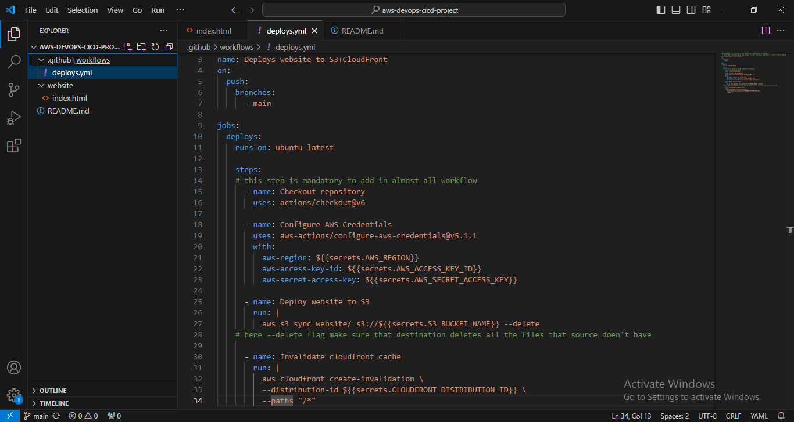
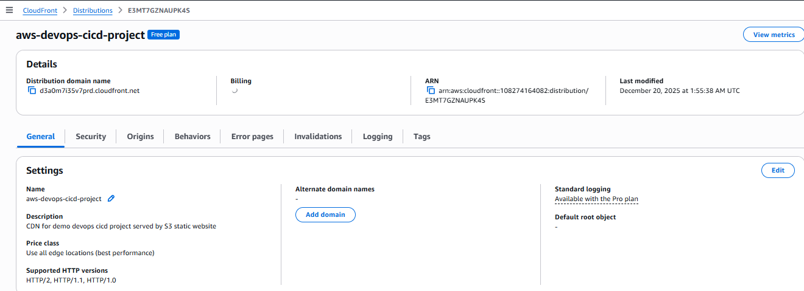
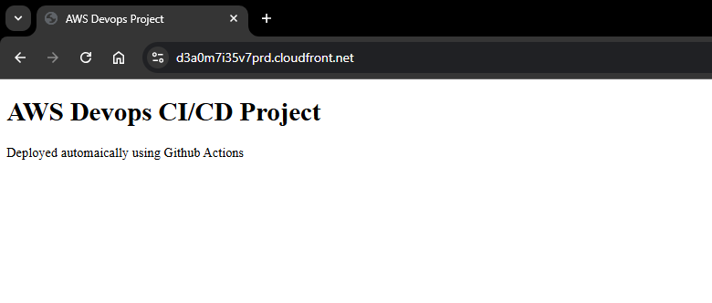

# aws-devops-ci-cd-project

## Project Overview
This project demonstrates an end-to-end DevOps CI/CD pipeline that automatically deploys a static website to **AWS S3** and serves it globally using **CloudFront CDN**, triggered by **GitHub Actions**.

Every push to the `main` branch automatically updates the live website.

---

## Architecture

GitHub Repository
→ GitHub Actions (CI/CD)
→ Amazon S3 (Static Website Storage)
→ Amazon CloudFront (CDN)

---

## Tech Stack
- GitHub Actions (CI/CD)
- Amazon S3
- Amazon CloudFront
- AWS IAM
- AWS CLI
- HTML

---

## CI/CD Workflow
1. Code is pushed to the `main` branch
2. GitHub Actions pipeline triggers automatically
3. AWS credentials are securely injected via GitHub Secrets
4. Static website files are synced to S3
5. CloudFront cache is invalidated
6. Updated content is served globally via CDN

---

## Security Practices
- No AWS credentials stored in code
- GitHub Secrets used for sensitive values
- IAM user has limited permissions

---

## Live Demo
CloudFront URL:
`https://d3a0m7i35v7prd.cloudfront.net/`

---

## DevOps Concepts Demonstrated
- CI/CD automation
- Infrastructure integration
- Cloud storage & CDN
- Secure secret management
- Cache invalidation
- GitOps workflow

---

## Future Improvements
- Private S3 bucket with CloudFront OAC
- Custom domain + HTTPS (ACM)
- Multi-environment deployment (dev/prod)
- Cache-control optimization
- Implement Infrastructure as a Code with Terraform

---

## Author
Krishna Halde

## Screenshots

### GitHub Actions – Successful Deployment
.PNG)

### CI/CD Workflow File

### S3 Bucket Deployment

### CloudFront Distribution

### Live Website via CloudFront CDN
